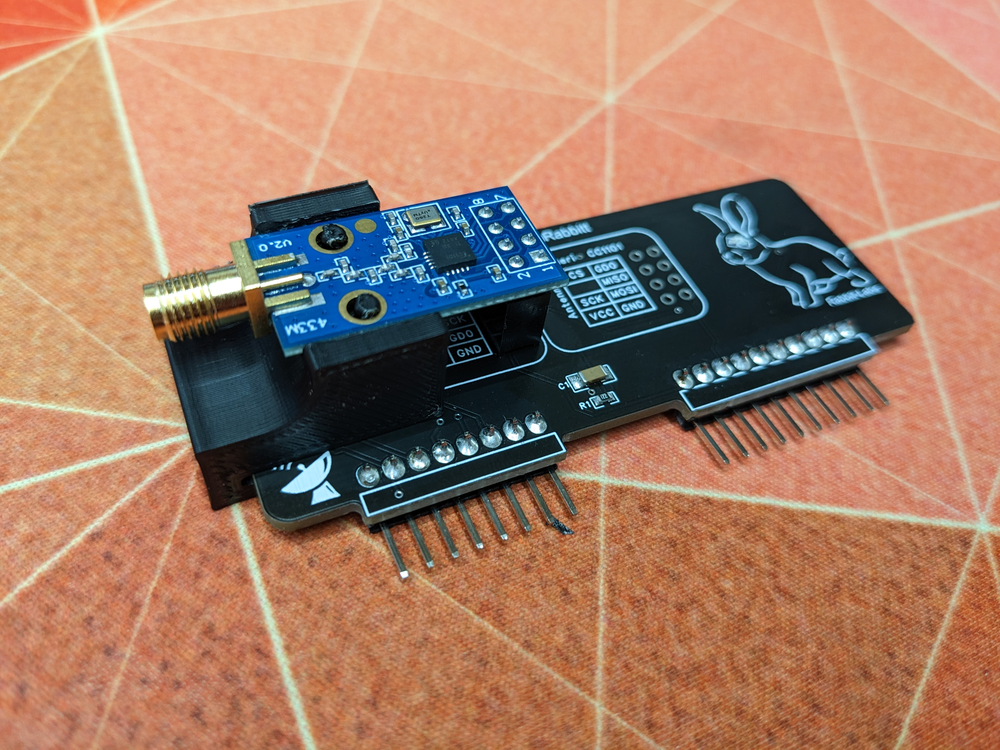
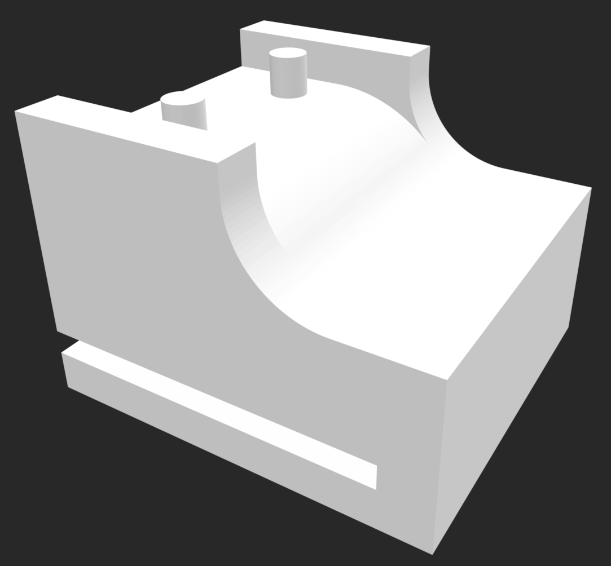

# CC1101 Holder

A simple holder that slides on to the side of your CC1101 expansion board, allowing for sturdy placement of the CC1101 on a header and easy replacement.

Download the STL file [here](./cc1101_holder.stl)

## 3D Render

